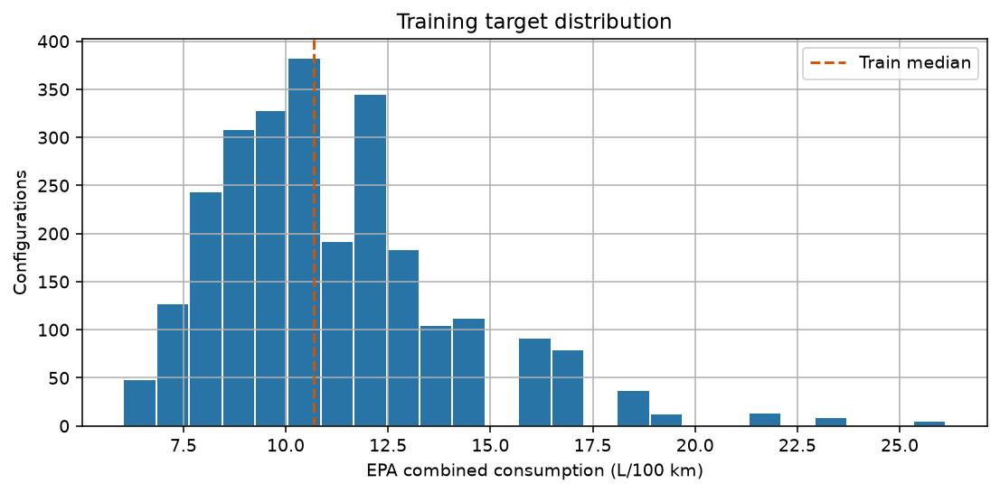
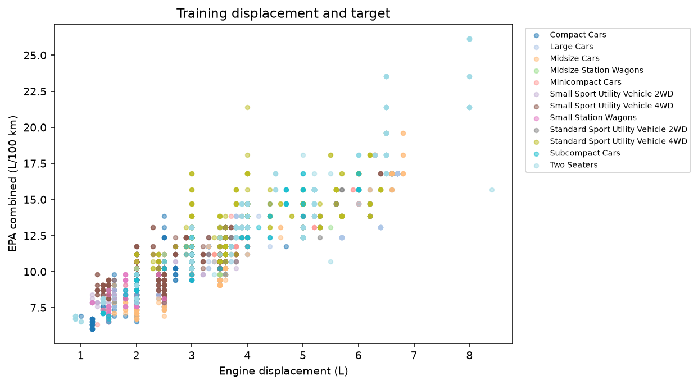
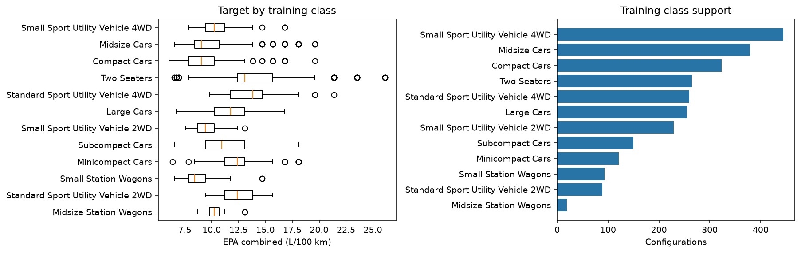
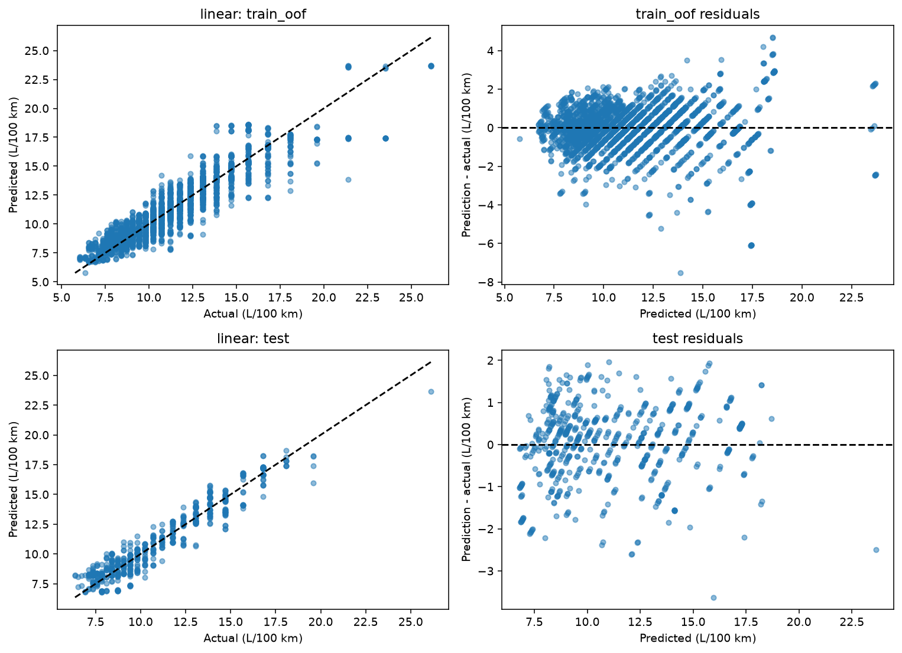

# EPA fuel consumption — результаты Midterm

SE-2421: Tsybus Nikita, Bakytzhan Kassymgali.

Вопрос: как точно можно предсказать EPA combined расход по семи техническим спецификациям? Для этого frozen snapshot модель **linear**, выбранная по train CV, имеет **test MAE 0.714 L/100 km** на 78 удержанных семействах (619 конфигураций). Это средняя ошибка стандартизованного EPA target, не гарантия для отдельной машины и не фактический дорожный расход.

## Данные и split

Retained rows: 3,247; производителей: 49; классов: 12; годы 2015–2025. Train: 2,628 rows / 311 families. Test: 619 rows / 78 families. 20% относятся к группам; фактическая test row fraction 19.1%. Grouping — manufacturer + baseModel через все годы, seed=42; train GroupKFold=5.

Очистка: 4,500 raw → 3,247 retained; 1,253 exclusions; 0 confirmed duplicates removed. Unresolved candidate groups: 0. Полный audit читается в notebook; независимые причины исключения пересекаются.

Target = 235.2145833333333 / comb08 (US MPG). Другие economy/cost/emissions/score поля, ID, grouping и text не входят в Midterm X. Все imputers/encoders/scalers fit внутри training fold pipeline.

## Train EDA

Train median 10.69, mean 11.15 L/100 km. Median обосновывает constant MAE baseline; допустимые хвостовые значения не удаляются только за высокий расход.

Pearson r=0.882 — ассоциация, не причинность или доказательство линейности. Сравнение LR/KNN/tree проверяет различные формы зависимости на одинаковых CV folds.

Самый представленный train class: Small Sport Utility Vehicle 4WD (n=445). 1 классов имеют train n<30; subgroup conclusions требуют размеров групп.

## Сравнение моделей

| model | cv_mae_mean | cv_mae_std | test_mae | test_rmse | test_r2 | cv_improvement_over_dummy_pct | test_improvement_over_dummy_pct | selected_by_cv |
| --- | --- | --- | --- | --- | --- | --- | --- | --- |
| dummy | 2.2088 | 0.3047 | 2.5970 | 3.1373 | -0.0173 | 0.0000 | 0.0000 | False |
| linear | 0.8134 | 0.1200 | 0.7138 | 0.8996 | 0.9164 | 63.1736 | 72.5156 | True |
| knn | 0.9143 | 0.0697 | 0.6924 | 0.9071 | 0.9150 | 58.6064 | 73.3364 | False |
| tree | 0.8924 | 0.0614 | 0.9167 | 1.4127 | 0.7937 | 59.5961 | 64.7024 | False |

Выбор **linear** сделан по mean train CV до test prediction. Test показан для всех четырех заранее заданных моделей; winner не меняется по test. CV std (ddof=0) не confidence interval. R² не процент правильных прогнозов.

## Ошибки

Residual = prediction − actual. Все OOF/test subgroup estimates с n, MAE, median error и bias: [subgroup_errors.csv](subgroup_errors.csv). Selected-model реальные test ошибки: [selected_large_errors.csv](selected_large_errors.csv). При n<30 надежность групп не ранжируется как установленный факт.

## Ограничения и следующие проверки

- Конфигурации не взвешены по продажам; accuracy относится к текущему покрытию каталога.
- Group split измеряет перенос на удержанные семейства, не будущие годы; родственные платформы могут остаться связаны.
- comb08 округлен; EPA оценка не заменяет наблюдение поведения водителя.
- Масса/мощность отсутствуют среди predictors; объяснение ошибок ими остается гипотезой.
- Ensembles/tuning проверяются на train grouped CV; clustering/PCA fit без target; MLP требует grouped validation.
- На Final сравниваются structured и model/engine text на тех же IDs, с fold-fit TF-IDF и leakage sanitation.
- Test после Midterm раскрыт; используем те же IDs для сравнения этапов, но не для tuning.

## Трассировка

Run `midterm_v1`; dataset SHA256 `f9152b6d24577b2abeb5c149fd5a247a49d9c098c7d0dd50202ed8d1ad652739`; split SHA256 `8ad5db3c3f606ef862fdbf8c72c215da93a8ec786ac208351370f8180352b9df`. Generated report не выполняет retraining. Вклад людей/AI фиксируется в docs/CONTRIBUTIONS.md; этот отчет не подтверждает слайды или репетицию защиты.
