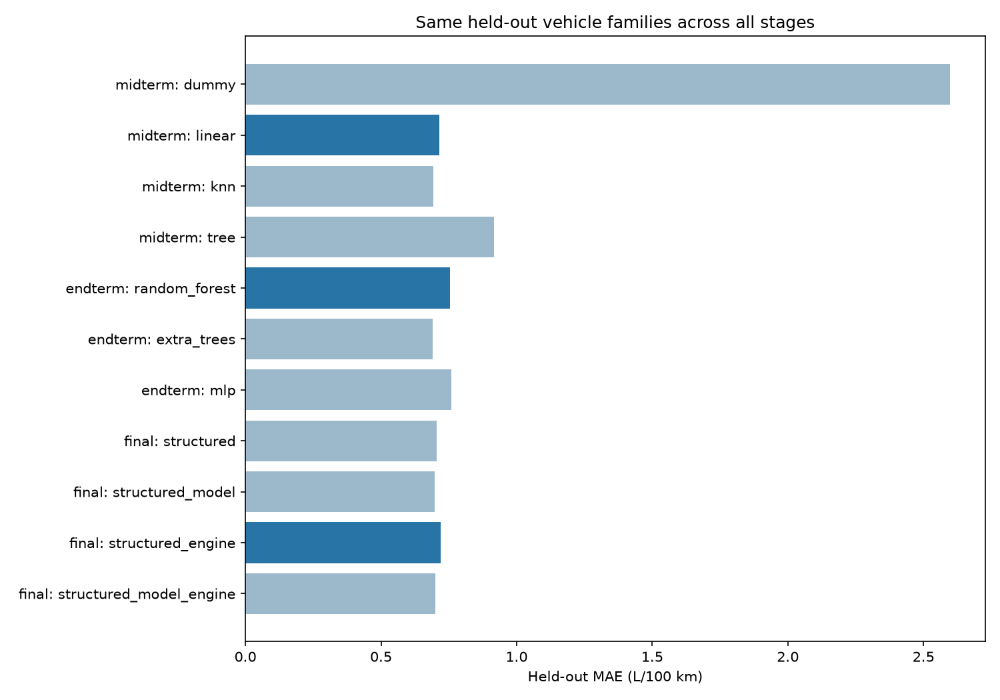
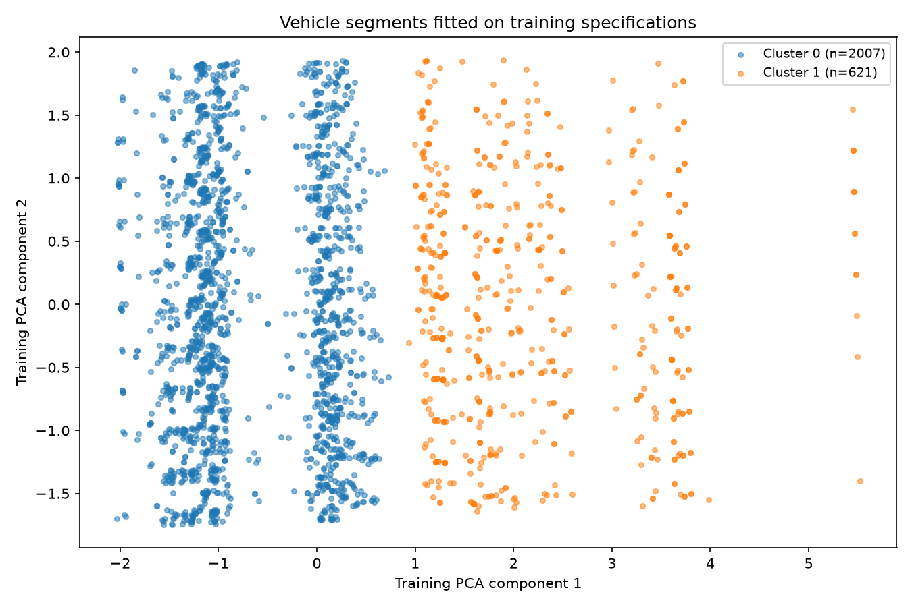

# EPA fuel-consumption regression: project results

A reproducible machine-learning study of EPA combined fuel consumption. SE-2421 team: Tsybus Nikita and Bakytzhan Kassymgali.

## Data and evaluation

Own individual-record FuelEconomy.gov API collection retained **3,247 valid configurations after complete-source duplicate checks** from 4,500 raw vehicle records. Years 2015–2025; 49 manufacturers and 12 vehicle classes. Scope is gasoline, non-hybrid passenger cars, station wagons and SUVs.

The target is `235.2145833333333 / comb08`, in L/100 km. The bounded, seeded catalogue sample has unequal inclusion probabilities and is not sales weighted. It is not a complete census or a forecast of real road consumption.

One frozen split contains 2,628 training rows in 311 families and 619 test rows in 78 held-out families. GroupShuffleSplit uses seed 42 and 20% of families; five GroupKFold training folds are reused. Preprocessing is fitted within training folds; all stages have identical dataset and split hashes.

## All saved models

| stage | model | cv_role | cv_mae_mean | cv_mae_std | test_mae | test_rmse | test_r2 | selected_by_cv |
| --- | --- | --- | --- | --- | --- | --- | --- | --- |
| midterm | dummy | fixed_model_group_cv | 2.2088 | 0.3047 | 2.5970 | 3.1373 | -0.0173 | False |
| midterm | linear | fixed_model_group_cv | 0.8134 | 0.1200 | 0.7138 | 0.8996 | 0.9164 | True |
| midterm | knn | fixed_model_group_cv | 0.9143 | 0.0697 | 0.6924 | 0.9071 | 0.9150 | False |
| midterm | tree | fixed_model_group_cv | 0.8924 | 0.0614 | 0.9167 | 1.4127 | 0.7937 | False |
| endterm | random_forest | outer_group_cv_of_search_procedure | 0.7402 | 0.0802 | 0.7543 | 1.0118 | 0.8942 | True |
| endterm | extra_trees | outer_group_cv_of_search_procedure | 0.7910 | 0.0646 | 0.6900 | 0.8882 | 0.9185 | False |
| endterm | mlp | outer_group_cv_of_search_procedure | 0.7969 | 0.0670 | 0.7581 | 0.9728 | 0.9022 | False |
| final | structured | selection CV for alpha and feature set, not an unbiased estimate of the tuning procedure | 0.7988 | 0.0816 | 0.7046 | 0.8972 | 0.9168 | False |
| final | structured_model | selection CV for alpha and feature set, not an unbiased estimate of the tuning procedure | 0.8055 | 0.0759 | 0.6966 | 0.8858 | 0.9189 | False |
| final | structured_engine | selection CV for alpha and feature set, not an unbiased estimate of the tuning procedure | 0.7888 | 0.0850 | 0.7195 | 0.9135 | 0.9138 | True |
| final | structured_model_engine | selection CV for alpha and feature set, not an unbiased estimate of the tuning procedure | 0.7959 | 0.0733 | 0.7006 | 0.8928 | 0.9176 | False |

MAE and RMSE use L/100 km. CV spread is the population standard deviation of five fold MAEs, not a confidence interval. `selected_by_cv` marks the winner within its stage, chosen before test prediction. Midterm CV evaluates fixed models. Endterm outer CV evaluates each family’s inner grouped search; choosing the family from those scores still introduces selection optimism. Final CV selects Ridge alpha and text arm, so its selection CV is optimistic and is not an unbiased tuning estimate.

## Stage decisions

- **midterm: linear**, CV MAE 0.8134; held-out MAE 0.7138, RMSE 0.8996, R² 0.9164.
- **endterm: random_forest**, CV MAE 0.7402; held-out MAE 0.7543, RMSE 1.0118, R² 0.8942.
- **final: structured_engine**, CV MAE 0.7888; held-out MAE 0.7195, RMSE 0.9135, R² 0.9138.

## What the comparisons establish

The Midterm CV-selected model reduces held-out MAE by 72.5% relative to the median baseline, with an average absolute error of 0.7138 L/100 km. This is useful predictive information for the declared catalogue sample, not a guarantee for an individual car or road trip.

The Endterm CV-selected model changes test MAE by +0.0405 L/100 km relative to the Midterm CV-selected model. Positive change means worse held-out error. The Final CV-selected arm changes test MAE by +0.0149 L/100 km relative to structured Ridge. These are descriptive test comparisons; the selections remain those made from training CV. A lower selection or outer CV score does not guarantee improvement on the fixed test set.

## Contribution of text

Four equally tuned Ridge arms isolate model names and available engine-description text. TF-IDF vocabularies fit only each training fold. The deterministic sanitizer removes explicit fuel-economy, cost, emissions and efficiency markers and their values; original text remains in the source data.

| text_arm | n_test | mean_abs_error_delta | n_text_better |
| --- | --- | --- | --- |
| structured_model | 619 | -0.0081 | 300 |
| structured_engine | 619 | 0.0149 | 289 |
| structured_model_engine | 619 | -0.0040 | 310 |

Delta is text-arm absolute error minus structured-Ridge absolute error on the same test rows: negative means improvement. This is a descriptive paired comparison, without independent-row significance claims. It compares Ridge feature sets; it does not establish that text will improve every estimator.

## Vehicle segments and neural network

Training-only PCA retained 49 components. KMeans selected k=2 by training silhouette 0.2544 from the predeclared range 2–6. Scaling and one-hot encoding affect these distances. Clusters describe configurations, not causal groups or market share; target summaries are calculated after selection.

| split | cluster | n | displacement_mean_l | displacement_median_l | cylinders_mean | target_mean_l100km | target_median_l100km |
| --- | --- | --- | --- | --- | --- | --- | --- |
| test | 0 | 425 | 2.2320 | 2.0000 | 4.4165 | 9.3876 | 9.0467 |
| test | 1 | 194 | 5.6582 | 6.0000 | 9.5464 | 14.8524 | 14.7009 |
| train | 0 | 2007 | 2.5143 | 2.4000 | 4.7549 | 9.9446 | 9.8006 |
| train | 1 | 621 | 5.2556 | 5.2000 | 9.2271 | 15.0566 | 14.7009 |

The MLP uses training-fold target scaling, grouped parameter search and no random-row early-stopping validation split. The final MLP fit used 164 iterations; the run recorded 0 training warnings, including 0 convergence warnings. All warning records are retained in the Endterm training-warning table.

## Errors, application and limits

Per-row predictions, train OOF and test subgroup MAE/bias/sample counts and difficult examples are available in `reports/tables/<run>/`. Sparse groups are descriptive and should not be used for strong reliability claims. Associations between specifications and consumption are not causal effects.

The local Streamlit application loads **structured_engine**, selected within Final by training CV. It validates specifications, uses training-only category options, checks saved-model hashes and returns L/100 km. It is the controlled Final text model, not a claim of being the globally best architecture. Missing optional text remains empty; predictions depend on the catalogue’s coverage.

Blank EPA technology labels do not independently certify a non-hybrid powertrain. Manufacturer-reviewed corrections and explicit uncertainty quarantine were fixed before splitting; further source omissions may remain. Seven auxiliary source encodings are unconfirmed and excluded from model inputs. The reviewed family aliases preserve conservative source taxonomy, not certified physical generations or platforms. See the [data card](../../docs/DATA_CARD.md) and [powertrain review](../../docs/POWERTRAIN_REVIEW.md).

All stages reuse the same test set as requested. Test results are comparisons, not a fresh independent confirmation of a later development process. No parameter, seed or feature choice is made from these reported test scores. Rounded source MPG creates a discrete converted target. The three stages implement the project’s predeclared progression from structured regressors to tuned models and controlled text comparisons.

## Descriptive errors of the application model

The following groups come from saved test diagnostics of the Final CV-selected arm. `small_support=True` means fewer than 30 observations; such groups do not establish a stable reliability ranking.

| subgroup | n | mae | bias | small_support |
| --- | --- | --- | --- | --- |
| Standard Sport Utility Vehicle 4WD | 34 | 1.1094 | -0.2257 | False |
| Small Station Wagons | 15 | 0.9796 | -0.8166 | True |
| Two Seaters | 82 | 0.9652 | -0.1807 | False |
| Small Sport Utility Vehicle 2WD | 38 | 0.7749 | 0.4379 | False |
| Minicompact Cars | 69 | 0.7690 | -0.4756 | False |

| subgroup | n | mae | bias | small_support |
| --- | --- | --- | --- | --- |
| (0,2] L | 285 | 0.7255 | 0.0730 | False |
| (2,3] L | 63 | 0.7438 | 0.1376 | False |
| (3,4] L | 108 | 0.5489 | -0.1332 | False |
| (4,+inf) L | 163 | 0.8127 | 0.2585 | False |
